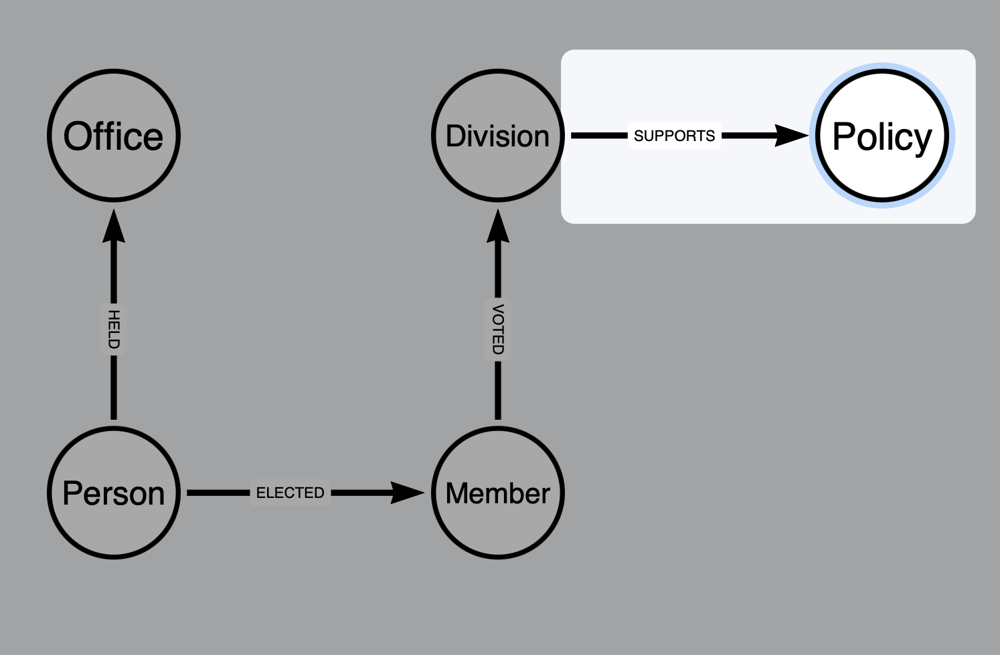

Note: Could automate the below, but adding manual steps initially for convenince

# Public whip Mariadb database dumps

Download and uncompress dumps, place them in ${HOME}/Downloads/mariadb/backupdir:

    https://www.publicwhip.org.uk/data/pw_static_tables.sql.bz2
    https://www.publicwhip.org.uk/data/pw_dynamic_tables.sql.bz2
    https://www.publicwhip.org.uk/data/pw_cache_tables.sql.bz2

# Start docker container for Mariadb

Run ./mariadb_docker.sh file from this repo and note `<container id>`.

# Mariadb Commands to load dumps

Exec into the container with a bash shell:

    docker exec -it <container id> /bin/bash

Create the public whip database:

    mysql --user root --password -e "CREATE DATABASE public_whip"

Run the following commands to load the dumps:

    mysql --user root --password public_whip < /backup/pw_static_tables.sql
    mysql --user root --password public_whip < /backup/pw_dynamic_tables.sql
    mysql --user root --password public_whip < /backup/pw_cache_tables.sql

# Export tables to CSV

Login to the mysql CLI using:

    mysql -u root -p

There doesn't seem to be an easy way to export a table to flat file with headers, so each header needs prepending as a row before export.  To make this slightly less manual, the following commands generate the header row by inspecting the table metadata, so that it can be pasted into each export commands.  This example is for the table pw_division:

    set session group_concat_max_len = 1000000;

    select GROUP_CONCAT(CONCAT("'",COLUMN_NAME,"'"))
    from INFORMATION_SCHEMA.COLUMNS
    WHERE TABLE_NAME = 'pw_division'
    order BY ORDINAL_POSITION

The following are the manually crafted export commands for the static and dynamic tables in public whip:

    // -- Static tables
    // +-----------------------+
    // | Tables_in_public_whip |
    // +-----------------------+
    // | pw_division           |
    // | pw_moffice            |
    // | pw_mp                 |
    // | pw_vote               |
    // +-----------------------+

    SELECT 'mp_id','first_name','last_name','title','constituency','party','entered_house','left_house','entered_reason','left_reason','person','house','gid'
    UNION ALL
    SELECT * FROM pw_mp INTO OUTFILE '/backup/pw_mp.csv' FIELDS TERMINATED BY 0x1e ENCLOSED BY '"' LINES TERMINATED BY '\n';

    SELECT 'division_id','mp_id','vote'
    UNION ALL
    SELECT * FROM pw_vote INTO OUTFILE '/backup/pw_vote.csv' FIELDS TERMINATED BY 0x1e ENCLOSED BY '"' LINES TERMINATED BY '\n';

    SELECT 'division_id','valid','division_date','division_number','division_name','source_url','motion','notes','debate_url','source_gid','debate_gid','house','clock_time'
    UNION ALL
    SELECT * FROM pw_division INTO OUTFILE '/backup/pw_division.csv' FIELDS TERMINATED BY 0x1e ENCLOSED BY '"' LINES TERMINATED BY '\n';

    SELECT 'division_id','valid','division_date','division_number','division_name','source_url','motion','notes','debate_url','source_gid','debate_gid','house','clock_time'
    UNION ALL
    SELECT * FROM pw_division INTO OUTFILE '/backup/pw_division.csv' FIELDS TERMINATED BY CHAR(30) ENCLOSED BY '"' LINES TERMINATED BY '\n';

    SELECT 'moffice_id','dept','position','from_date','to_date','person','responsibility'
    UNION ALL
    SELECT * FROM pw_moffice INTO OUTFILE '/backup/pw_moffice.csv' FIELDS TERMINATED BY 0x1e ENCLOSED BY '"' LINES TERMINATED BY '\n';

    // -- Dynamic tables
    // pw_dyn_dreammp
    // pw_dyn_dreamvote
    // pw_dyn_wiki_motion 

    SELECT 'dream_id','name','user_id','description','private' 
    UNION ALL
    SELECT * FROM pw_dyn_dreammp INTO OUTFILE '/backup/pw_dyn_dreammp.csv' FIELDS TERMINATED BY 0x1e ENCLOSED BY '"' LINES TERMINATED BY '\n';

    SELECT 'division_date','division_number','dream_id','vote','house'
    UNION ALL
    SELECT * FROM pw_dyn_dreamvote INTO OUTFILE '/backup/pw_dyn_dreamvote.csv' FIELDS TERMINATED BY 0x1e ENCLOSED BY '"' LINES TERMINATED BY '\n';

    SELECT 'wiki_id','text_body','user_id','edit_date','division_date','division_number','house'
    UNION ALL
    SELECT * FROM pw_dyn_wiki_motion INTO OUTFILE '/backup/pw_dyn_wiki_motion.csv' FIELDS TERMINATED BY 0x1e ENCLOSED BY '"' LINES TERMINATED BY '\n';

The flat files are then available in the container's `/backup` folder for subsequent import into data importer.  The model and mapping `public_whip_neo4j_importer_model.json` is available in this repository, along with a zip which additionally containins the data.

# Importing files that can't yet be mapped in Data Importer

Some of the files cannot yet be mapped to Data Importer because the mapping functionality is not yet sufficiently rich. An exmaple is the Policy Label and SUPPORTS relationship that links to a Division, as shown below:

This requires that Data Importer support:
    
    * Compound keys
    * Potentially, supporting different Idnentifiers to map different relationships to a node*

*Not completely required in this example as the existing mapping for the VOTED relationship could be switched to use the same compound ID as supports, but it could be useful:

In the interim, the following LOAD CSV commands can be used:

    // Create the Policy nodes
    LOAD CSV WITH HEADERS FROM 'file:///pw_dyn_dreammp.csv' as row
    MERGE (p:Policy {dream_id: row.dream_id})
    SET p+=row;

    // Create a multi-key index on Divisions
    CREATE INDEX division FOR (d:Division) ON (d.division_number, d.division_date, d.house);

    // MERGE a relationship between policies and divisions using a compound identifier and single identifier to link the two:
    LOAD CSV WITH HEADERS FROM 'file:///pw_dyn_dreamvote.csv' as row
    MATCH (d:Division {division_number: row.division_number, division_date: row.division_date, house: row.house}), (p:Policy {dream_id: row.dream_id})
    MERGE (d)-[:SUPPORTS {vote: row.vote}]->(p);
